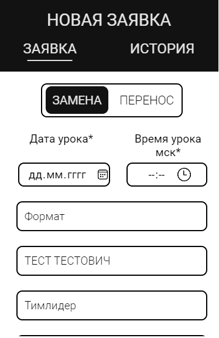
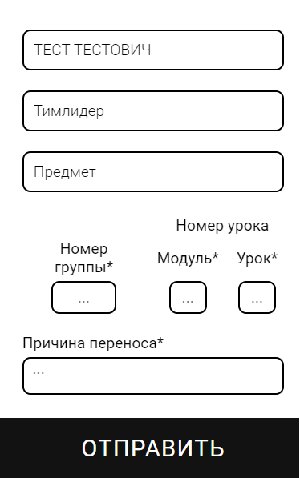

# Tech Bot

Tech Bot - это веб-приложение и телеграм-бот, предназначенные для автоматизации процессов в образовательной среде. Проект интегрируется с различными системами для управления заявками, уведомлениями и рассылками.

## Основные функции

- **Отправка форм в ClickHouse**: Автоматическая отправка форм, собранных за сутки, в базу данных ClickHouse для анализа.
  
- **Управление заявками на замену/перенос**: Пользователи могут подавать, редактировать и просматривать историю заявок на замену или перенос занятий через веб-форму. Заявки хранятся в кэше в течение времени, указанного в конфигурации.

- **Уведомления о занятиях**: Интеграция с API школы для отправки преподавателям уведомлений о предстоящих занятиях. Уведомления отправляются утром и за 30 минут до каждого занятия с кнопкой подтверждения.

- **Работа с Google таблицами**: Парсинг Google таблиц для получения информации о днях рождения сотрудников и отправка напоминаний менеджерам. Формы также сохраняются в Google таблицах.

- **Меню в Telegram для рассылок**: Настройка и отправка рассылок преподавателям через меню в Telegram. Рассылки могут быть отправлены в личные сообщения или в другие чаты, данные о которых берутся из Google таблиц.

## Скриншоты
  
  
  

## Требуемые сертификаты и ключи

Для работы проекта необходимы следующие сертификаты и ключи:

- **SSH ключи**: 
  - `cert/id_rsa.pub`
  - `cert/Public-key`

- **SSL/TLS сертификаты**:
  - `cert/RootCA.crt`: Используется для установления SSL-соединения с ClickHouse.
  - `cert/IntermediateCA.pem`: Может использоваться для других соединений, если это требуется.

Убедитесь, что эти файлы находятся в соответствующих директориях и правильно настроены в конфигурационных файлах.

## Конфигурация

Конфигурация проекта осуществляется через файл `.env`, который содержит параметры для настройки приложения, такие как токены, идентификаторы чатов и другие важные переменные.

## Установка и запуск

1. **Клонируйте репозиторий**:
   ```bash
   git clone https://github.com/DEPTH-STRIDA/tech-bot
   ```

2. **Перейдите в директорию проекта**:
   ```bash
   cd CodeTech_bot
   ```

3. **Установите зависимости**:
   ```bash
   go mod download
   ```

4. **Настройте файл `.env`**: Укажите необходимые параметры конфигурации.

5. **Запустите приложение**:
   ```bash
   go run cmd/tech_bot/main.go
   ```

